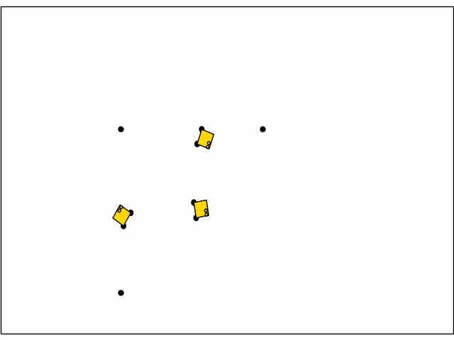

# JaxRobotarium: Train and Deploy Multi-Robot Policies in 10 Minutes
<p align="center">
       <a href= "https://github.com/GT-STAR-Lab/JaxRobotarium/blob/main/LICENSE">
        </a>
       <a href= "https://arxiv.org/abs/2505.06771">
        </a>
       
</p>
<p float="middle">
  
   
</p>


## Installation (assumes integration with JaxMARL as platform of choice)
### Install Jax and JaxMARL
1. Create a conda env
    ```
    conda create -n "jaxrobotarium" python=3.10 ipython
    conda activate jaxrobotarium
    ```
3. Clone and install JaxRobotarium (from top of repo)
    ```
    pip install -e .
    ```
2. Install JaxMARL (from top of repo, see https://github.com/GT-STAR-Lab/JaxMARL-Robotarium)
    ```
    pip install -e .
    ```
3. Install cuda runtime
    ```
    pip install nvidia-cuda-runtime-cu12
    ```
4. Install Jax
    ```
    pip install -U "jax[cuda12]==0.5.0"
    ```
### Install Robotarium Simulator
1. Initialize the Robotarium Simulator submodule
    ```
    git submodule init
    git submodule update
    ```
2. Install (within `jaxrobotarium/robotarium_python_simulator)
    ```
    pip install -e .
    ```

## Training
### Config
See `baselines` for config examples. We call out some config parameters here, but see example configs, `robotarium_env.py` and scenario definitions to better understand all parameters.
```
"ENV_NAME": ...
"ENV_KWARGS": {
  "num_agents": # must be identical to number of robots,
  "max_steps": 100,
  "action_type": # Discrete or Continuous,
  "robotarium": {
    "number_of_robots": # must be identical to num agents,
  },
  "controller": {
    "controller": # controller for robot to go to goal,
    "barrier_fn": # collision avoidance,
  },
  "update_frequency": 30
}
```
Callouts:
- `"action_type"`, if Discrete, actions are interpreted as waypoints to follow, if Continuous, actions are interpreted as unicycle velocity commands, `"controller"` should be set to `null`
- see `constants.py` for available controllers and barrier functions, set to `null` to not use any
- `update_frequency` controls how many robotarium steps are taken per environment step

### Run Training
**Example**: train a multi-robot navigation policy
```
python baselines/QLearning/qmix_rnn.py +alg=ql_rnn_navigation
```

## Deployment to Robotarium
See `README.md` in `deploy/` for detailed instructions on how to deploy to the Robotarium.

## Dev Notes
### Unit Testing
Each folder has a `test` folder to add unit tests for the files in that folder. For example to run unit tests for `navigation.py`, run,
```
python -m unittest jaxrobotarium/scenarios/test/test_navigation.py
```

### Scenario Cross-Compatibility
In order to compatible with the Robotarium hardware platform, developed scenarios must be compatible with the non-jax Robotarium simulator. To achieve this, every scenario should only contain the following import.
```
# wrap import statement in try-except block to allow for correct import during deployment
try:
    from jaxrobotarium.robotarium_env import *
except Exception as e:
    from robotarium_env import *
```
And the following logic within `__init__`,
```
if self.backend == 'jax':
    super().__init__(num_agents, max_steps, **kwargs)
else:
    self.num_agents = num_agents
    self.initial_state = self.initialize_robotarium_state(kwargs.get("seed", 0))
    kwargs['initial_conditions'] = self.initial_state.p_pos[:self.num_agents, :].T
    super().__init__(num_agents, max_steps, **kwargs)
```
where `initialize_robotarium_state` is specific to the scenario being developed. See `scenarios/navigation.py` for an example.